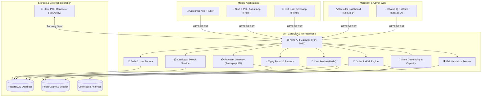

# 🛍️ Zippyra — Next-Generation Frictionless Scan & Go Retail Platform

[](https://golang.org)
[](https://flutter.dev)
[](https://nextjs.org)
[](https://aws.amazon.com/eks/)
[](LICENSE)

**Zippyra** is an enterprise-grade, end-to-end Scan & Go self-checkout, anti-theft validation, and retail operations ecosystem. It eliminates checkout queues in hypermarkets and retail stores by allowing shoppers to scan barcodes on their mobile phones, pay instantly via UPI/Card, and exit securely through automated gate verification kiosks.

---

## 🌟 Executive Overview & Key Capabilities

- **⚡ Frictionless In-Store Scan & Go**: Real-time barcode scanning camera engine with auto-focus, product pricing, aisle location tagging, and sticky live cart calculation.
- **🛡️ Automated Anti-Theft Exit Verification**: Time-stamped, encrypted QR code tokens with gate relay hardware integration to prevent shrink and theft.
- **🧾 GST & DPDPA Compliance (India)**: Automated CGST/SGST tax computation, B2C e-invoice signed QR codes, and DPDPA 2023 compliant data privacy controls (*Manage My Data* & data erasure requests).
- **🔌 POS & ERP Connector Daemon**: Two-way real-time inventory sync adapter for legacy POS systems (Tally ERP 9/Prime, Busy ERP, and custom SQL databases).
- **📊 Real-Time Merchant Analytics**: Revenue trend charts, peak hours heatmap, product movement funnels, low stock alerts, and multi-store inventory transfers.

---

## 🏗️ System Architecture



---

## 📂 Repository Workspace Structure

```
Zippyra/
├── backend/                       # Go Microservices & Shared Libraries
│   ├── services/
│   │   ├── auth-service/          # Customer & OTP Authentication
│   │   ├── catalog-service/       # Product Catalog & Barcode Engine
│   │   ├── cart-service/          # High-performance Redis Cart
│   │   ├── order-service/         # Order Creation & Receipt Generator
│   │   ├── payment-service/       # Razorpay / UPI Payment Gateways
│   │   ├── store-service/         # Geofencing & Store Capacity Limits
│   │   ├── compliance-service/    # GST e-Invoice & Signed QR Engine
│   │   ├── exit-service/          # Exit Gate Security Tokens
│   │   ├── loyalty-service/       # Zippy Points & Tier Calculation
│   │   └── analytics-service/     # ClickHouse Revenue & Traffic Pipeline
│   └── shared/                    # Common Go Logger, DB, JWT & Middleware
├── mobile/                        # Flutter Monorepo (Melos-managed)
│   ├── customer_app/              # Scan & Go Customer Shopping App
│   ├── staff_app/                 # Store Staff POS Assist & Stock Count
│   ├── kiosk_app/                 # Exit Gate Kiosk Hardware Application
│   └── packages/zippyra_core/     # Shared UI Design System & Network SDK
├── web/                           # Next.js 14 Web Applications
│   ├── apps/retailer/             # Merchant Store Management Dashboard
│   └── packages/ui/               # Shared React UI Component Library
├── zippyra-connector/             # Store POS Daemon (Tally/Busy Adapter)
├── infra/                         # Terraform IaC & Kubernetes Manifests
│   ├── eks/                       # AWS EKS Kubernetes Cluster Setup
│   ├── kubernetes/                # Kong API Gateway & Microservice Pods
│   └── terraform/                 # AWS VPC, RDS, ElastiCache, S3 & WAF
└── docs/                          # OpenAPI 3.0 Specs, ADRs & Postman Collections
```

---

## 🚀 Quick Start & Local Development Setup

### 📋 Prerequisites
Ensure you have the following installed on your machine:
- **Go**: `v1.22` or higher
- **Flutter SDK**: `v3.19` or higher
- **Node.js**: `v20.x` & `pnpm`
- **Docker & Docker Compose**: Latest desktop build

---

### 1️⃣ Bootstrap Environment & Dependencies
Initialize all sub-modules, Flutter packages, and Node dependencies:

```bash
# Clone the repository
git clone https://github.com/Krishnakr21/Zippyra-A-Retail-Checkout.git
cd Zippyra

# Run bootstrap script
./install.sh
```

---

### 2️⃣ Run Full Local Stack
Spin up Go backend microservices, Redis, PostgreSQL, and Flutter web servers:

```bash
./run_all.sh
```

#### 🌐 Access Local Application Interfaces
- **Customer Shopping App (Web)**: `http://localhost:3020`
- **Staff POS Assist App (Web)**: `http://localhost:3021`
- **Merchant Dashboard (Web)**: `http://localhost:3000`
- **Go API Gateway**: `http://localhost:8080`

---

### 3️⃣ Shutdown Local Stack Cleanly
To stop all running background microservices and Flutter web instances:

```bash
./stop_all.sh
```

---

## 🧪 Testing & Quality Assurance

Run complete test suites across backend and mobile applications:

```bash
# Run Flutter customer app unit & widget tests
cd mobile/customer_app && flutter test

# Run Go backend microservice tests
cd backend && go test ./...

# Run Web dashboard E2E tests
cd web/apps/retailer && pnpm test:e2e
```

---

## 🔒 Security & Privacy

- **Data Encryption**: All PII (mobile numbers, transaction tokens) is encrypted at rest using AES-256 and in transit via TLS 1.3.
- **DPDPA 2023 & GDPR Compliance**: Full customer data export, communication preference controls, and permanent account erasure mechanisms.
- **Push Protection**: Automated credential and API key secret scanning.

---

## 👨‍💻 Author & Maintainer

Developed and maintained by **Krishna Kumar**:
- **GitHub**: [@Krishnakr21](https://github.com/Krishnakr21)
- **Email**: [romeokanhai@gmail.com](mailto:romeokanhai@gmail.com)

---

## 📄 License

This repository is licensed under the [MIT License](LICENSE).
